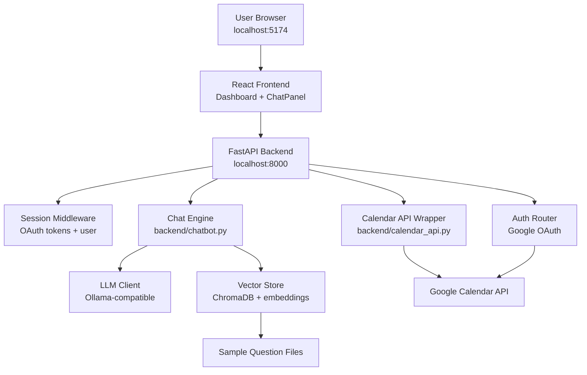
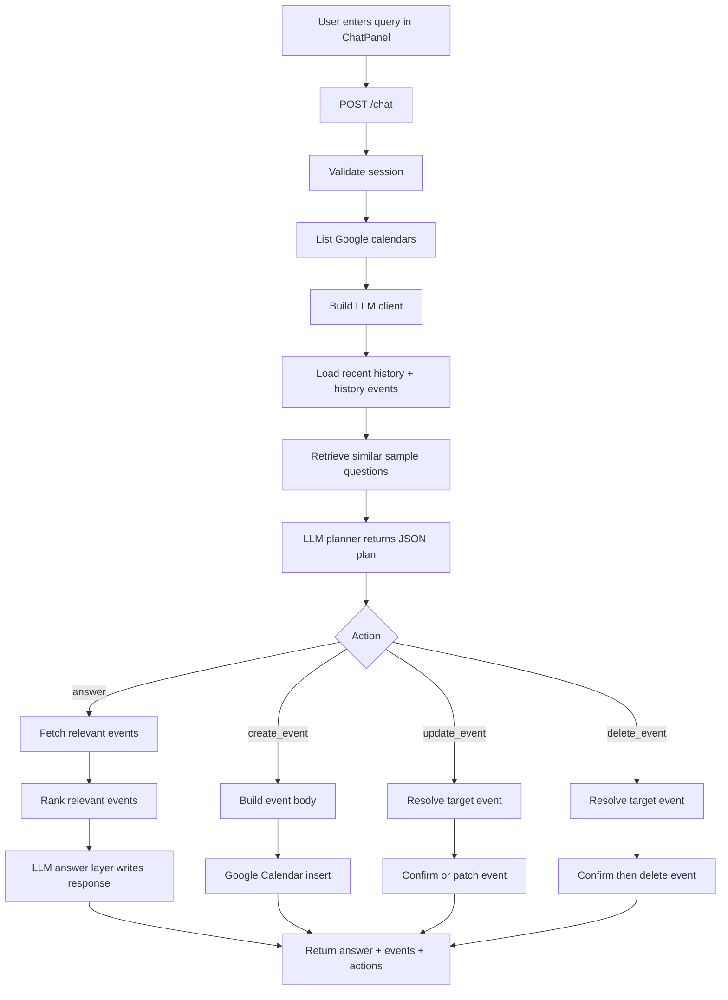
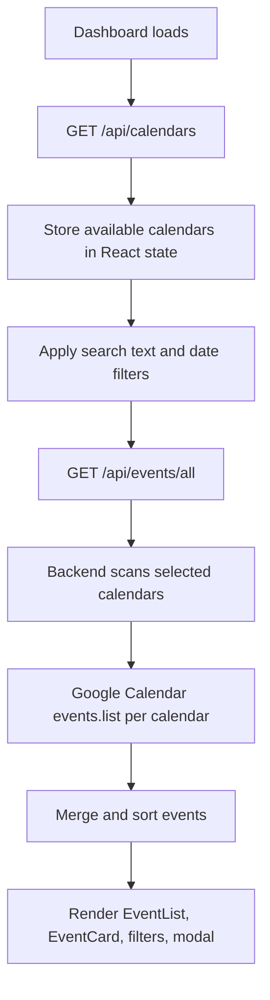
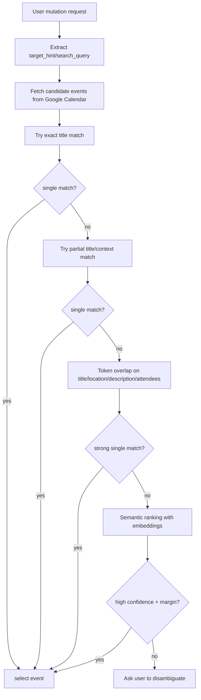
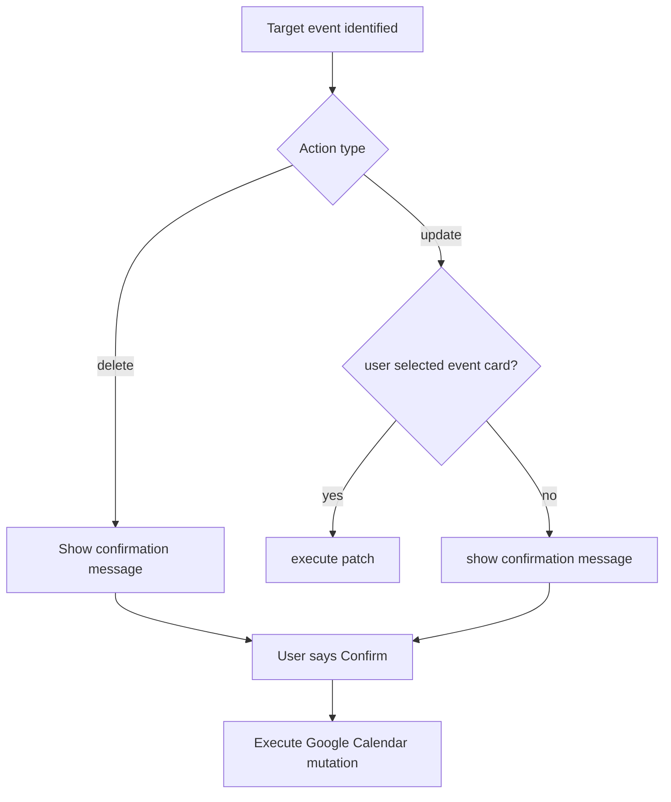
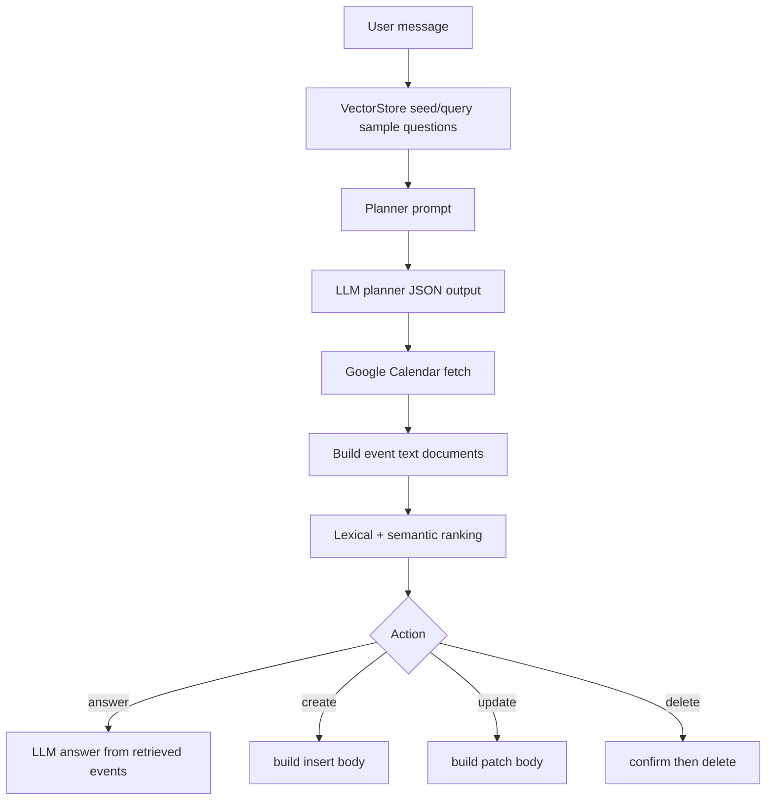

# Google Calendar Agentic Chatbot Documentation

## 1. Executive Summary

This project is a generic Google Calendar agentic assistant. It is not limited to dentist appointments. It is designed to:

- connect to a user's Google Calendar with Google OAuth
- show calendars and events in a React dashboard
- answer natural-language questions about events
- create new events
- update existing events
- delete events with confirmation
- identify the correct target event from ambiguous user language

The current system uses a retrieval-plus-planning architecture:

- live Google Calendar events are fetched at request time
- sample question corpora are embedded and stored in ChromaDB
- an LLM plans the requested action and generates the final answer
- deterministic matching and semantic ranking are combined to identify the right event

The latest state of the project includes:

- generic event understanding beyond dentist-specific cases
- safer event disambiguation for update and delete flows
- improved pronoun and follow-up handling
- backend running on `http://localhost:8000`
- frontend running on `http://localhost:5174`
- OAuth callback on `http://localhost:8000/auth/callback`

## 2. Current Local Runtime

| Item | Value | Why It Matters |
|---|---|---|
| Frontend URL | `http://localhost:5174` | avoids conflict with another project already using `5173` |
| Backend URL | `http://localhost:8000` | matches the currently working Google OAuth redirect URI |
| OAuth Callback | `http://localhost:8000/auth/callback` | must exist in Google Cloud Console |
| Frontend Proxy Target | `http://localhost:8000` | Vite forwards `/auth`, `/api`, and `/chat` to FastAPI |
| Startup Script | `start.bat` | starts backend and frontend with the correct ports |

## 3. What The System Does

### Main user-facing capabilities

1. Show all calendars available to the authenticated Google user.
2. Load events across one or more calendars.
3. Answer questions like:
   - `What do I have tomorrow?`
   - `When is my meeting with Rahul?`
   - `Do I have anything in conference room A this week?`
4. Create events like:
   - `Schedule a project sync tomorrow at 4 pm`
5. Update events like:
   - `Move my meeting with Rahul to 5 pm`
   - `Reschedule the planning session to Friday`
6. Delete events like:
   - `Cancel my booking tomorrow`
   - `Remove the lunch with Aman`

### Important design goal

The system should identify events properly for any calendar domain, not only dentist appointments. Dentist workflows can sit on top of the generic engine, but the base event-resolution logic is generic.

## 4. Full Technology Stack

| Layer | Technology | Where Used | Purpose | Why Used |
|---|---|---|---|---|
| Frontend UI | React 19 | `frontend/src/` | renders login, dashboard, event list, chat panel, modal | component-based UI with fast iteration |
| Frontend Router | React Router | `frontend/src/App.jsx` and routing setup | page navigation between login and dashboard | simple SPA routing |
| Frontend Dev Server | Vite | `frontend/vite.config.js` | local dev server, proxy, build tooling | fast startup and modern React tooling |
| Styling | Tailwind CSS | `frontend/src/index.css`, component class names | layout, spacing, visual design | utility-first styling with low overhead |
| Animations | Framer Motion | frontend page/components | animated UI sections and cards | smooth lightweight UI motion |
| HTTP Client | Axios | `frontend/src/api/client.js` | browser requests to backend with cookies | simple API wrapper and interceptor support |
| Date Helpers | date-fns | `frontend/src/pages/Dashboard.jsx` | quick filters like today/week/upcoming | practical date arithmetic for UI filters |
| Backend API | FastAPI | `backend/main.py`, `backend/chatbot.py`, `backend/auth.py` | HTTP API routes and chat endpoints | clear Python API framework with validation |
| ASGI Server | Uvicorn | `start_backend.bat`, `start.bat`, `render.yaml` | runs FastAPI app | standard FastAPI runtime |
| Sessions | Starlette SessionMiddleware | `backend/main.py`, `backend/session.py` | stores auth/session data | simple server-side session handling |
| OAuth | `google-auth`, `google-auth-oauthlib` | `backend/auth.py`, `backend/calendar_api.py` | Google login and token exchange | required for Google Calendar access |
| Google Calendar API | `google-api-python-client` | `backend/calendar_api.py` | list calendars, fetch events, create, patch, delete | official API client |
| Env Loading | `python-dotenv` | `backend/config.py` | load `backend/.env` | local configuration management |
| LLM Provider | Ollama | `backend/ollama_client.py` | planner and answer generation when running local/cloud Ollama-compatible endpoint | low-cost local-first option |
| Vector DB | ChromaDB | `backend/vector_store.py`, `backend/chroma_db/` | persistent storage for sample question embeddings | simple local vector storage |
| Embeddings | Sentence Transformers `all-MiniLM-L6-v2` | `backend/vector_store.py` | semantic embedding for retrieval/ranking | strong lightweight embedding model |
| Testing Backend | Pytest | `tests/backend/` | backend regression tests | straightforward Python testing |
| Testing Frontend | Vitest + Testing Library | `frontend/src/**/*.test.jsx` | component and page tests | modern frontend test stack |
| Deployment | Render | `render.yaml` | production/service deployment | simple full-stack hosting option |

## 5. Which Models Are Used, Where, and Why

### Model table

| Model / Provider | Config Source | Where Used | Purpose |
|---|---|---|---|
| `deepseek-v3.1:671b-cloud` via Ollama | `backend/.env` `OLLAMA_CHAT_MODEL` and `backend/config.py` default | `backend/chatbot.py` through `OllamaClient` | planning user intent and generating final natural-language answers |
| `all-MiniLM-L6-v2` | hardcoded in `backend/vector_store.py` | `backend/vector_store.py` | embeddings for semantic retrieval over sample questions and event text |

### How model selection works

The backend uses the configured Ollama-compatible chat client:

```python
def _build_llm_client():
    cfg = get_ollama_config()
    return OllamaClient(
        base_url=cfg["base_url"],
        chat_model=cfg["chat_model"],
        api_key=cfg.get("api_key", ""),
    )
```

### Why each model exists

| Model Type | Why It Exists |
|---|---|
| Chat model | turns free-text user requests into a structured action plan and writes final user-facing answers |
| Embedding model | compares the user request against sample questions and event text semantically |
| Vector DB | persists sample question embeddings so they do not need to be rebuilt every request |

## 6. Project Structure

```text
.
|-- backend/
|   |-- main.py
|   |-- auth.py
|   |-- calendar_api.py
|   |-- chatbot.py
|   |-- config.py
|   |-- ollama_client.py
|   |-- session.py
|   |-- vector_store.py
|   |-- .env
|   |-- .env.example
|   `-- requirements.txt
|-- frontend/
|   |-- src/
|   |   |-- api/client.js
|   |   |-- components/
|   |   |-- context/
|   |   `-- pages/
|   |-- package.json
|   `-- vite.config.js
|-- rag_samples/
|-- tests/backend/
|-- google_calendar_rag_1000_questions.txt
|-- PROJECT_DOCUMENTATION.md
|-- render.yaml
|-- start.bat
|-- start.ps1
|-- start_backend.bat
|-- start_frontend.bat
`-- wait_for_backend.ps1
```

## 7. Main Entry Points

| Entry Point | File | Role |
|---|---|---|
| Backend app | `backend/main.py` | creates FastAPI app, middleware, auth routes, chat routes, event routes |
| Chat logic | `backend/chatbot.py` | planner, retrieval, event selection, create/update/delete logic |
| Calendar integration | `backend/calendar_api.py` | direct wrapper around Google Calendar API |
| Frontend app | `frontend/src/main.jsx` | boots the React application |
| Dashboard | `frontend/src/pages/Dashboard.jsx` | event browsing, filters, manual event operations |
| Chat UI | `frontend/src/components/ChatPanel.jsx` | sends natural-language requests to `/chat` |
| Full project startup | `start.bat` | starts backend on `8000` and frontend on `5174` |

## 8. High-Level System Architecture

### Box diagram

```text
+-------------------+         +-------------------------+
|   User Browser    | <-----> |   React Frontend        |
|  localhost:5174   |         |  Vite + React + Axios   |
+-------------------+         +-----------+-------------+
                                            |
                                            v
                                +-------------------------+
                                |   FastAPI Backend       |
                                |   localhost:8000        |
                                +-----------+-------------+
                                            |
                 +--------------------------+---------------------------+
                 |                          |                           |
                 v                          v                           v
      +-------------------+      +---------------------+      +------------------+
      | Session / Auth    |      | Chat / Agent Logic  |      | Calendar Routes  |
      | auth.py/session.py|      | chatbot.py          |      | main.py          |
      +-------------------+      +----------+----------+      +------------------+
                                                |
                         +----------------------+----------------------+
                         |                                             |
                         v                                             v
              +----------------------+                    +----------------------+
              | LLM Provider         |                    | Retrieval Layer      |
              | Ollama-compatible    |                    | Chroma + embeddings  |
              +----------------------+                    +----------+-----------+
                                                                     |
                                                                     v
                                                         +----------------------+
                                                         | Sample Questions +   |
                                                         | Event Match Text     |
                                                         +----------------------+
                                            |
                                            v
                                +-------------------------+
                                | Google Calendar API     |
                                +-------------------------+
```

### Mermaid flowchart



## 9. End-to-End User Query Flow

### Flowchart



### Step-by-step explanation

1. The frontend sends the raw user message and recent chat history to `POST /chat`.
2. The backend validates the session and loads available calendars.
3. The backend builds an Ollama-compatible LLM client from `backend/.env`.
4. The retrieval layer loads or queries semantically similar sample questions.
5. The planner prompt asks the LLM for a strict JSON plan.
6. The backend normalizes that plan and applies deterministic fixes.
7. The backend fetches live calendar events from Google Calendar.
8. The backend resolves the action:
   - answer: rank relevant events and ask the answer layer to respond
   - create_event: build a Google event body and insert it
   - update_event: identify the correct event, build patch body, confirm if needed
   - delete_event: identify the correct event, confirm, then delete
9. The API returns the answer text plus any matched events and action metadata.

## 10. Authentication Flow

### Box flow

```text
+--------+     +------------------+     +------------------------+
|  User  | --> |  /auth/login     | --> | Google Consent Screen  |
+--------+     +------------------+     +------------------------+
                                                 |
                                                 v
                                  +------------------------------+
                                  | /auth/callback               |
                                  | exchange code for tokens     |
                                  +--------------+---------------+
                                                 |
                                                 v
                                  +------------------------------+
                                  | session saved + redirect to  |
                                  | frontend dashboard           |
                                  +------------------------------+
```

### Code example

```python
@router.get("/login")
def login(request: Request):
    flow = _make_flow()
    auth_url, state = flow.authorization_url(
        access_type="offline",
        prompt="select_account consent",
    )
    request.session["oauth_state"] = state
    return RedirectResponse(auth_url)
```

```python
@router.get("/callback")
def callback(request: Request, code: str, state: str):
    flow = _make_flow()
    flow.fetch_token(code=code)
    credentials = flow.credentials
    save_tokens(request, tokens, user)
    return RedirectResponse(f"{frontend_url}/dashboard")
```

### Why this design is used

- keeps Google tokens out of the frontend
- centralizes OAuth and credential refresh in backend Python code
- allows the frontend to stay a simpler cookie-based SPA

## 11. Dashboard Event Loading Flow

### Flowchart



### Frontend example

```jsx
const { data } = await api.get(`/api/events/all?${params.toString()}`)
setEvents(data.events ?? [])
```

### Backend example

```python
events, scanned_calendar_ids = fetch_all_events(
    creds,
    calendar_ids=selected_calendar_ids or None,
    q=q,
    time_min=from_date,
    time_max=to_date,
    max_results=maxResults,
)
```

### Why this design is used

- supports multiple Google calendars in one view
- keeps the browser simple by centralizing Google API access in the backend
- allows the same event data path to be reused by the chat engine

## 12. Generic Event Understanding and Operation Detection

The agent now treats the problem as two separate tasks:

1. understand what operation the user wants
2. identify which event the user means

### Operation detection

The planner and fallback layer classify the request as one of:

- `answer`
- `create_event`
- `update_event`
- `delete_event`

The fallback path uses regex-based action cues for generic calendar language:

```python
_DELETE_ACTION_RE = re.compile(r"\b(cancel|delete|remove|drop)\b", re.IGNORECASE)
_UPDATE_ACTION_RE = re.compile(
    r"\b(update|move|reschedule|change|edit|modify|shift|rename|postpone|delay)\b",
    re.IGNORECASE,
)
_CREATE_ACTION_RE = re.compile(
    r"\b(create|schedule|book|add|set up|make)\b", re.IGNORECASE
)
```

### Why this matters

It prevents common failures such as:

- treating `cancel my booking` as create instead of delete
- treating `move my meeting` as a generic answer request
- missing generic phrases like `rename`, `postpone`, or `drop`

## 13. Generic Event Identification Flow

### Goal

Correctly identify the intended event across any domain such as:

- meetings
- dentist appointments
- follow-ups
- lunch plans
- interviews
- reminders
- personal bookings

### Matching signals currently used

| Signal | Source | Purpose |
|---|---|---|
| exact title match | event title | strongest direct match |
| partial title match | event title | catches shortened user references |
| attendee match | attendee names/emails | identifies `meeting with Rahul` |
| location match | event location | identifies `event in conference room A` |
| description match | description text | catches contextual references |
| organizer match | organizer email | useful for externally created events |
| history event reference | prior assistant event cards | resolves `that one`, `it`, `this event` |
| semantic ranking | embedding similarity | fallback when lexical match is not enough |

### Event selection flowchart



### Event match text example

The backend builds richer text for matching, not just the title:

```python
def _event_match_text(event: dict) -> str:
    attendee_parts = []
    for attendee in event.get("attendees", []):
        display_name = attendee.get("displayName") or attendee.get("email", "").split("@")[0]
        if display_name:
            attendee_parts.append(display_name)
    parts = [
        event.get("title", ""),
        event.get("location", ""),
        (event.get("description") or "")[:300],
        event.get("organizer", ""),
        " ".join(attendee_parts),
    ]
    return " | ".join(part for part in parts if part)
```

### Why this design is used

- user queries often refer to people, rooms, or context instead of exact titles
- calendar titles are often incomplete or inconsistent
- update and delete actions need higher safety than answer-only retrieval

## 14. Confirmation Flow For Dangerous Actions

Delete and most update actions are not executed immediately unless the user selected a specific event card or explicitly confirms.

### Flowchart



### Why this design is used

- delete is irreversible
- update can affect the wrong event if the target was inferred incorrectly
- confirmation reduces accidental mutation risk

## 15. RAG Architecture

### What data is used in RAG

The system uses two retrieval sources:

1. static sample-question corpus
   - `google_calendar_rag_1000_questions.txt`
   - `rag_samples/create_event_questions.txt`
   - `rag_samples/update_event_questions.txt`
   - `rag_samples/delete_event_questions.txt`
   - `rag_samples/general_query_questions.txt`

2. live Google Calendar event data
   - fetched in real time through Google Calendar API
   - converted into matchable text at request time

### Important distinction

This is not a classic document RAG system over PDFs or long knowledge bases. It is a hybrid RAG system:

- static corpus retrieval for intent calibration
- live event retrieval for current factual answers and mutations

## 16. Proper RAG Model Flow

### RAG block diagram

```text
+----------------------+        +-----------------------------+
| User Message         | -----> | Embed / retrieve similar    |
| "move my meeting..." |        | sample questions            |
+----------------------+        +--------------+--------------+
                                               |
                                               v
                                  +-----------------------------+
                                  | Planner LLM                 |
                                  | returns JSON action plan    |
                                  +--------------+--------------+
                                               |
                                               v
                                  +-----------------------------+
                                  | Fetch live calendar events  |
                                  | from Google Calendar API    |
                                  +--------------+--------------+
                                               |
                                               v
                                  +-----------------------------+
                                  | Deterministic + semantic    |
                                  | event ranking               |
                                  +--------------+--------------+
                                               |
                                               v
                                  +-----------------------------+
                                  | Answer LLM or mutation      |
                                  | execution                   |
                                  +-----------------------------+
```

### Mermaid RAG flowchart



### Vector store example

```python
class VectorStore:
    _MODEL_NAME = "all-MiniLM-L6-v2"

    def embed(self, texts: list[str]) -> list[list[float]]:
        return self._model.encode(texts, normalize_embeddings=True).tolist()
```

### Sample-question retrieval example

```python
vs = get_vector_store()
vs.seed_sample_questions(sample_questions)
similar_questions = vs.query_sample_questions(request_message, top_k=6)
```

### Event ranking example

```python
documents = [_event_to_document(event, calendar_lookup) for event in events]
ranked_indices = get_vector_store().rank_texts(query, documents, top_k)
```

### Why the current RAG design is used

- sample questions help the planner understand user phrasing patterns
- live event retrieval ensures answers are based on current calendar state
- semantic ranking helps when the user does not use the exact event title

## 17. Where The Stack Is Used, With Example Code

### React

Used for the browser UI.

```jsx
export default function ChatPanel() {
  const [messages, setMessages] = useState([STARTER_MESSAGE])

  const sendMessage = async (message) => {
    const { data } = await api.post('/chat', { message, history })
    setMessages((current) => [...current, { role: 'assistant', content: data.answer }])
  }
}
```

Purpose:

- user interaction
- rendering events
- showing chat and confirmations

Why React:

- reusable components
- predictable state updates
- good fit for dashboard plus chat UI

### Axios

Used for browser-to-backend requests.

```javascript
const api = axios.create({
  baseURL: '',
  withCredentials: true,
  headers: { 'Content-Type': 'application/json' },
})
```

Purpose:

- call `/auth`, `/api`, and `/chat`
- automatically send session cookies

### FastAPI

Used for backend HTTP APIs.

```python
@api_router.get("/events/all")
def get_all_events(request: Request, q: Optional[str] = None):
    tokens = get_tokens(request)
    creds = build_credentials(tokens)
    events, scanned_calendar_ids = fetch_all_events(creds, q=q)
    return {"events": events, "calendarsScanned": scanned_calendar_ids}
```

Purpose:

- API routing
- request validation
- chat endpoint orchestration

Why FastAPI:

- simple route design
- strong typing
- good fit for Python service code

### Google Calendar API

Used for live event data and mutations.

```python
def create_event(credentials: Credentials, calendar_id: str, body: dict) -> dict:
    service = build("calendar", "v3", credentials=credentials)
    event = service.events().insert(calendarId=calendar_id, body=body).execute()
    return serialize_event(event, calendar_id)
```

Purpose:

- real calendar reads and writes

Why used:

- source of truth for actual appointments and events

### ChromaDB + Sentence Transformers

Used for semantic retrieval.

```python
self._questions_col = self._chroma.get_or_create_collection(
    "sample_questions",
    metadata={"hnsw:space": "cosine"},
)
```

Purpose:

- store and query embedded sample questions

Why used:

- faster and more flexible than pure keyword lookup

### Ollama-Compatible Chat Model

Used for planning and answer generation.

```python
plan = client.chat_json(system_prompt, user_prompt)
answer = client.chat_text(system_prompt, user_prompt)
```

Purpose:

- convert raw user language into structured action plans
- produce final conversational answers

Why used:

- LLMs are good at intent extraction and natural response generation

## 18. Current Configuration

### Backend environment

```env
REDIRECT_URI=http://localhost:8000/auth/callback
FRONTEND_URL=http://localhost:5174
OLLAMA_BASE_URL=http://127.0.0.1:11434
OLLAMA_CHAT_MODEL=deepseek-v3.1:671b-cloud
```

### Frontend proxy

```javascript
server: {
  port: 5174,
  strictPort: true,
  proxy: {
    '/auth': 'http://localhost:8000',
    '/api': 'http://localhost:8000',
    '/chat': 'http://localhost:8000',
  },
}
```

### Why these ports are used

- `8000` stays on the original backend OAuth callback that is already valid in Google Cloud Console
- `5174` avoids collision with another local Vite app that was already using `5173`

## 19. Current Testing State

Latest verified test state during the recent update:

- backend: `45 passed`
- frontend: `30 passed`

Areas covered include:

- chat planner and answer flow
- event resolution safety
- pronoun/history handling
- calendar fallback behavior
- frontend chat interactions
- dashboard loading behavior

## 20. Known Design Characteristics

### Strengths

- uses live Google Calendar as source of truth
- separates planner and answer layers
- supports both manual UI actions and natural-language chat actions
- has safer update/delete confirmation behavior
- generic event identification is improving beyond title-only matching

### Current limits

- event identification still depends partly on LLM extraction quality
- there is no separate structured entity schema yet for people/location/time/title hints
- sample-question RAG helps understanding, but it is not a replacement for deterministic event resolution

## 21. Recommended Next Improvement

The strongest next architectural step is a structured event-reference layer.

Proposed extracted fields:

- `title_hint`
- `people`
- `location`
- `time_range`
- `calendar_hint`
- `operation`

That would let the resolver score fields independently instead of relying mainly on one free-text `target_hint`.

## 22. Final Summary

This project is now a generic Google Calendar agentic chatbot with a hybrid RAG architecture.

It uses:

- React + Vite for the frontend
- FastAPI + Uvicorn for the backend
- Google OAuth and Google Calendar API for authentication and calendar operations
- Ollama-compatible chat model for planning and answer generation
- ChromaDB + `all-MiniLM-L6-v2` for semantic retrieval

The core workflow is:

1. understand the user query
2. decide the requested operation
3. retrieve live events and similar sample questions
4. identify the correct target event using deterministic and semantic signals
5. answer, create, update, or delete safely

The current architecture is suitable for demos and real-world calendar workflows, and it is now documented around the latest codebase rather than the older narrower dentist-only framing.
