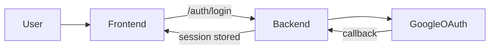
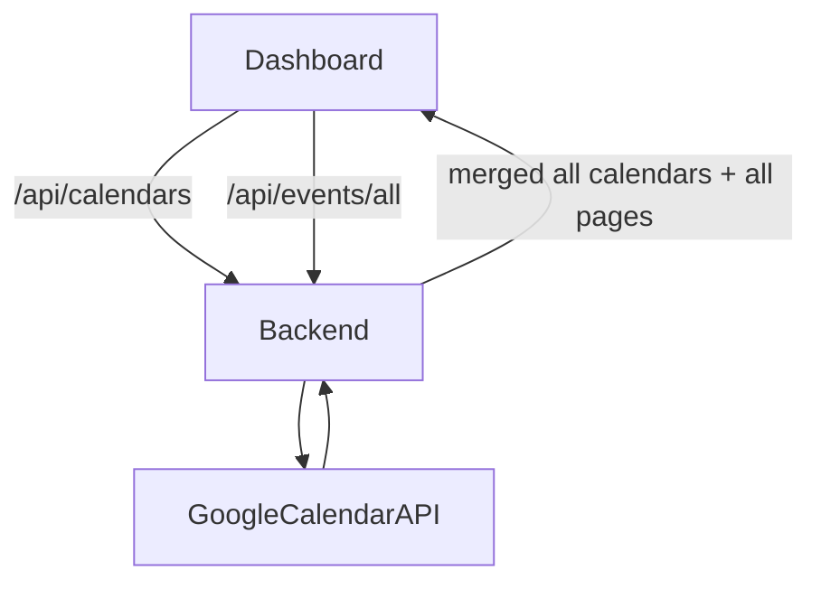
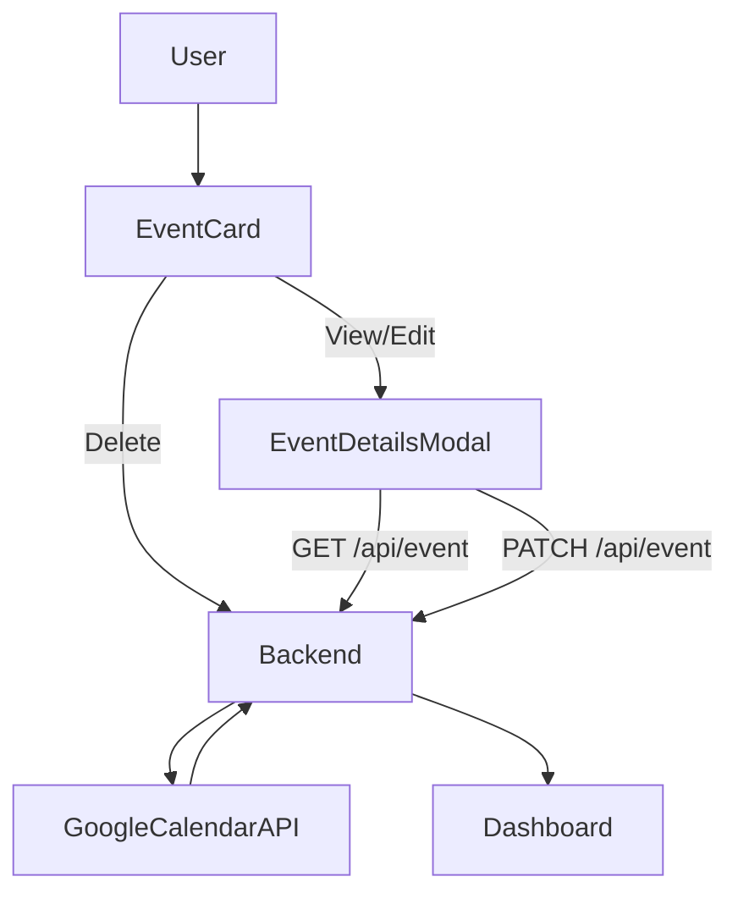
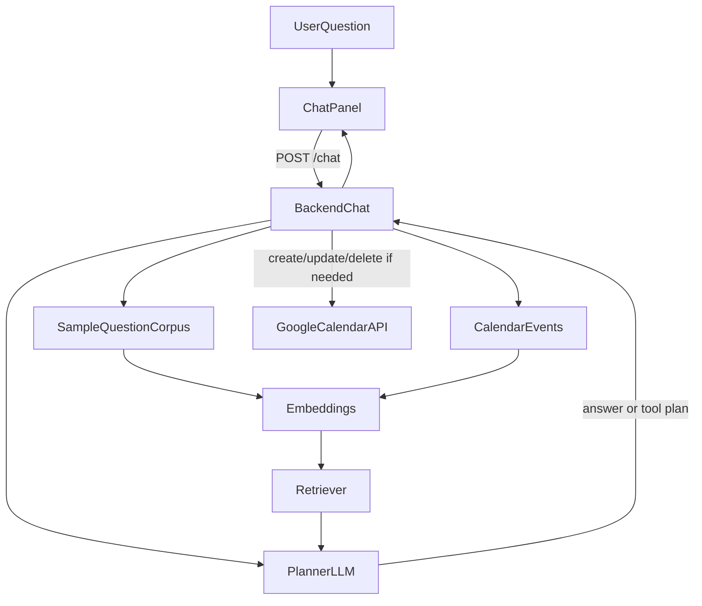
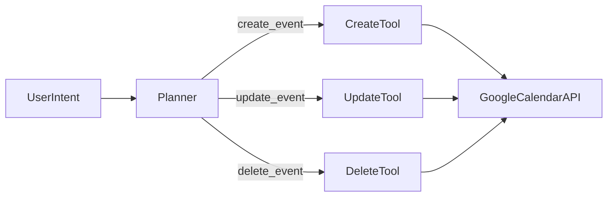

# Project Documentation

## Summary

This project is a Google Calendar assistant with three core capabilities:

1. OAuth login with Google Calendar
2. Full calendar event loading across all selected calendars and all pages
3. An agentic RAG chatbot that answers questions over live calendar data and can create, update, and delete events

It also includes direct manual event management in the UI:

1. View event details in a modal
2. Edit any event field manually
3. Delete events with confirmation
4. Refresh the dashboard to pull the latest calendar state after chatbot or manual changes

The app is built to run locally on Windows with a React frontend, FastAPI backend, Google Calendar API, and Ollama for local LLM + embeddings.

## Stack Used

### Frontend

- React
- Vite
- Tailwind CSS
- Axios
- Framer Motion

### Backend

- FastAPI
- Uvicorn
- Google Calendar API via `google-api-python-client`
- `python-dotenv`
- `httpx`

### Local AI / RAG

- Ollama
- Chat model: `llama3.1:8b`
- Embedding model: `nomic-embed-text:latest`

## Where Each Part Is Used

### Frontend

- `frontend/src/pages/Dashboard.jsx`
  Main dashboard, event loading, filters, and chatbot panel layout.
- `frontend/src/components/EventList.jsx`
  Event rendering.
- `frontend/src/components/EventCard.jsx`
  Per-event actions for view, edit, and delete.
- `frontend/src/components/EventDetailsModal.jsx`
  Manual event detail viewer and full edit form.
- `frontend/src/components/FilterPanel.jsx`
  All-events and date-range filtering.
- `frontend/src/components/ChatPanel.jsx`
  RAG chatbot UI.

### Backend

- `backend/auth.py`
  Google OAuth login and callback.
- `backend/calendar_api.py`
  Calendar read, full-event loading, and create/update/delete helpers.
- `backend/chatbot.py`
  RAG pipeline, retrieval, planner, and calendar action execution.
- `backend/config.py`
  Shared environment and model configuration.
- `backend/main.py`
  API registration and endpoint wiring.

### Startup Scripts

- `start.bat`
  Starts Ollama if needed, backend, and frontend.
- `start_backend.bat`
  Starts FastAPI.
- `start_frontend.bat`
  Starts Vite.
- `start_ollama.bat`
  Starts Ollama locally if it is not already running.

## How It Works

### OAuth Flow



### Event Loading Flow



### Manual Event Management Flow



### RAG Chat Flow



### Calendar Action Flow



## Why This Stack Was Used

### React + Vite

- fast local development
- simple component structure
- easy chatbot + dashboard integration

### FastAPI

- lightweight and fast for local APIs
- clean routing for auth, events, and chat
- easy to test

### Google Calendar API

- required for real calendar data and event mutation
- supports read, create, update, delete, recurrence, reminders, and multiple calendars

### Ollama + Local Models

- avoids mandatory cloud API keys
- keeps private calendar data local
- makes the project runnable end-to-end on one machine

### `nomic-embed-text`

- strong local text embeddings
- works well for retrieval over both sample questions and event documents

## RAG Design

The chatbot is not hardcoded to the 1000 sample questions.

It uses two retrieval sources:

1. The sample 1000 questions file to retrieve similar user intents and phrasing
2. The live Google Calendar events to retrieve actual schedule context

The retrieved sample questions help the planner generalize intent patterns.
The retrieved events provide factual grounding for answers and actions.

## Reliability Improvements

The current chat pipeline now includes a few guardrails to improve query understanding and reduce incorrect actions:

1. Time-filtered answer queries no longer fall back to unrelated events when the requested date range has no matches.
2. Retrieval now uses a stronger hybrid strategy so semantic matches are still considered when lexical overlap is weak or zero.
3. Answer, update, and delete requests default to searching across all calendars when the planner does not name a calendar.
4. Update and delete requests use safer target resolution so paraphrases can still match semantically, but single weak candidates require clarification instead of being changed automatically.
5. All-day event overlap handling now respects Google Calendar's exclusive end-date behavior, which fixes adjacent-day answers.
6. The frontend no longer sends the canned starter assistant message as part of the model history.

## Sample Code

### Full Event Loading

```python
events, scanned_calendar_ids = fetch_all_events(
    creds,
    calendar_ids=selected_calendar_ids or None,
    q=q,
    time_min=from_date,
    time_max=to_date,
    max_results=maxResults,
)
```

### Ollama Embeddings

```python
response = self._post(
    "/api/embed",
    {
        "model": self.embed_model,
        "input": uncached_texts,
    },
)
```

### Chat Planning

```python
plan = _plan_chat_action(
    payload.message,
    payload.history,
    calendars,
    sample_questions,
    client,
)
```

### Calendar Mutation

```python
updated = update_event(
    creds,
    target_event["calendarId"],
    target_event["id"],
    body,
)
```

## Environment Configuration

Configured in `backend/.env`:

```env
GOOGLE_CLIENT_ID=...
GOOGLE_CLIENT_SECRET=...
REDIRECT_URI=http://localhost:8000/auth/callback
FRONTEND_URL=http://localhost:5173
OLLAMA_BASE_URL=http://127.0.0.1:11434
OLLAMA_CHAT_MODEL=llama3.1:8b
OLLAMA_EMBED_MODEL=nomic-embed-text:latest
RAG_SAMPLE_QUESTIONS_FILE=google_calendar_rag_1000_questions.txt
```

## Required Models

If they are not already installed:

```bash
ollama pull llama3.1:8b
ollama pull nomic-embed-text:latest
```

## Run Instructions

Use:

```bat
start.bat
```

This will:

1. check Ollama
2. start Ollama if needed
3. start FastAPI on `localhost:8000`
4. start Vite on `localhost:5173`
5. open the frontend in the browser

## Current Verification

- backend tests pass
- frontend tests pass
- dashboard loads through the all-events endpoint
- OAuth login works
- Calendar API event loading works after enabling Google Calendar API
- chatbot backend and UI are wired into the app
- manual event view/edit/delete is wired into the dashboard
- dashboard refresh button reloads current calendar state

## Notes

- The chatbot uses retrieval plus live calendar tools. It is not restricted to the exact 1000 sample questions.
- The 1000-question file is used as a retrieval corpus to improve intent coverage.
- If a calendar mutation request is ambiguous, the chatbot asks for clarification rather than changing the wrong event.
