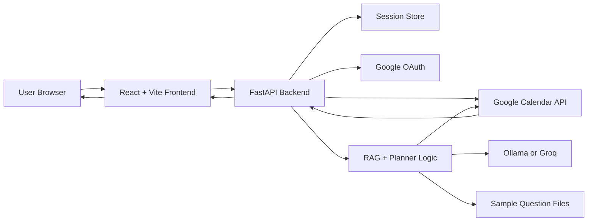
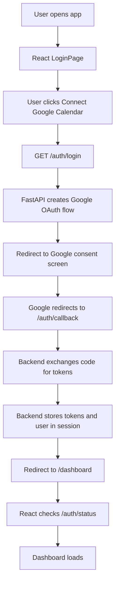
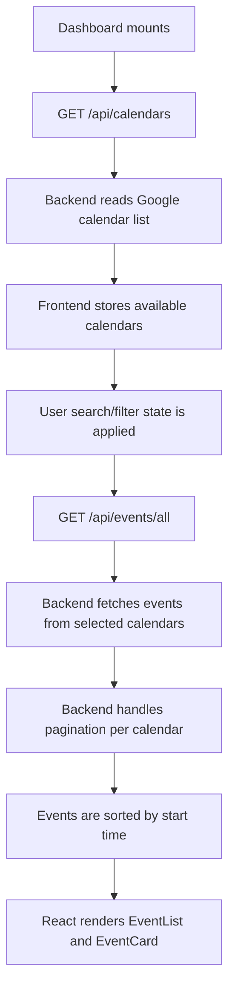
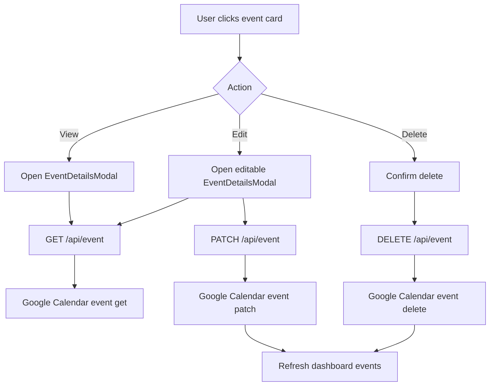
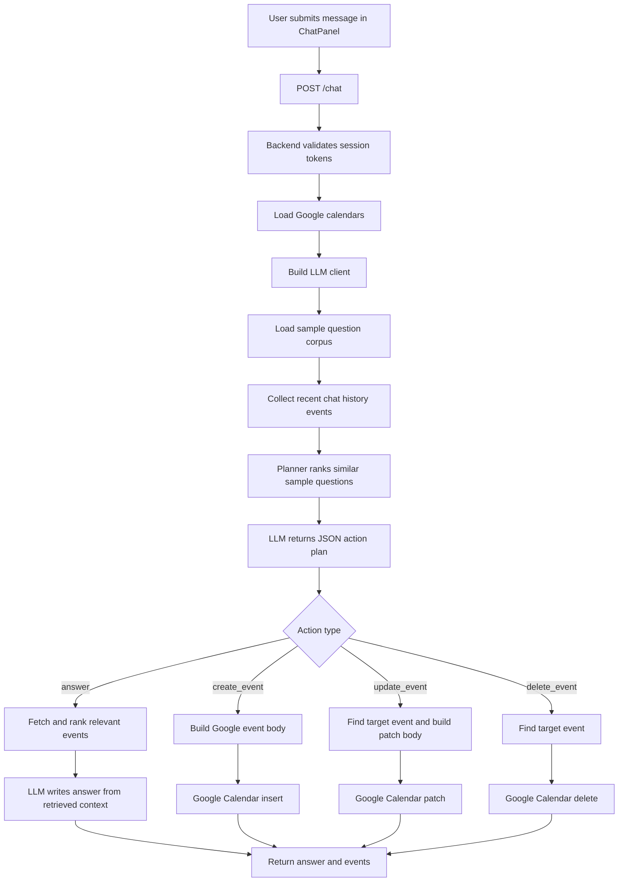
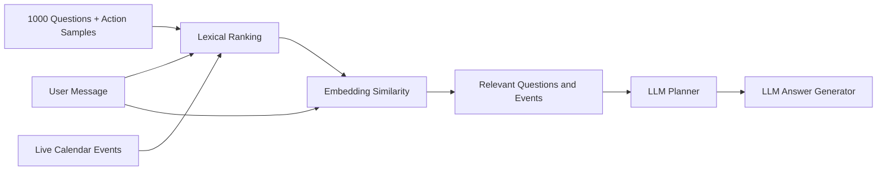
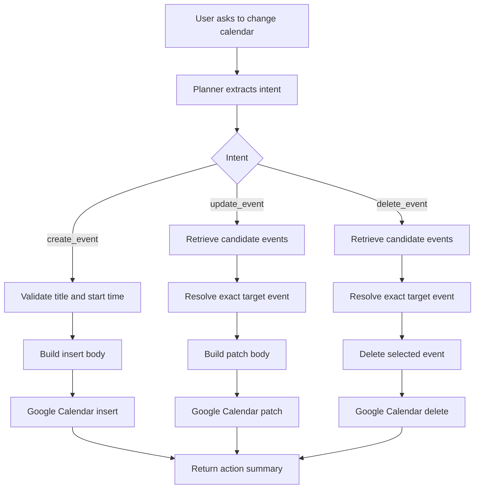
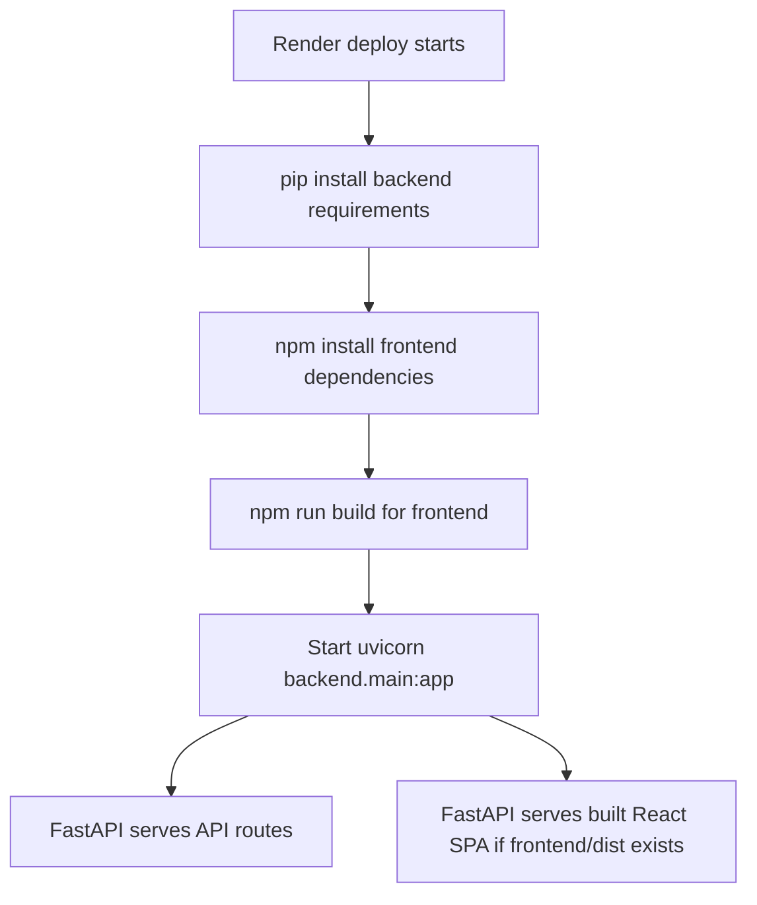

# Google Calendar RAG Chatbot Documentation

## 1. Project Overview

This project is an agentic Google Calendar assistant. It connects to a user's Google Calendar through OAuth, loads calendar events into a React dashboard, and provides a chat assistant that can answer calendar questions or perform calendar actions such as creating, updating, and deleting events.

The assistant uses a RAG-style workflow. It combines:

- Live Google Calendar event data
- A sample question corpus from `google_calendar_rag_1000_questions.txt`
- Action-specific sample questions from `rag_samples/`
- An LLM planner and answer generator through Ollama or Groq
- Retrieval and ranking logic to select relevant calendar events

No application code was changed for this documentation.

## 2. Technology Stack

| Layer | Technology | Where It Is Used | How It Is Used |
|---|---|---|---|
| Frontend | React | `frontend/src/` | Builds the login page, dashboard, event list, filters, modal, and chat panel. |
| Frontend Build Tool | Vite | `frontend/vite.config.js`, `frontend/package.json` | Runs the local dev server and builds production frontend assets. |
| Styling | Tailwind CSS | `frontend/src/index.css`, component class names | Provides utility-first styling for the dashboard and chat UI. |
| HTTP Client | Axios | `frontend/src/api/client.js` | Sends browser requests to FastAPI and includes session cookies. |
| UI Animation | Framer Motion | `LoginPage.jsx`, `EventList.jsx`, `FilterPanel.jsx` | Adds simple page, card, and panel animations. |
| Date Utilities | date-fns | `Dashboard.jsx` | Builds quick filters such as today, week, month, and upcoming. |
| Backend API | FastAPI | `backend/main.py`, routers | Exposes auth, calendar, event, health, and chat endpoints. |
| ASGI Server | Uvicorn | `start_backend.bat`, `render.yaml` | Runs the FastAPI application. |
| Google Auth | google-auth, google-auth-oauthlib | `backend/auth.py`, `backend/calendar_api.py` | Handles OAuth login, token exchange, and credential refresh. |
| Google Calendar API | google-api-python-client | `backend/calendar_api.py` | Reads calendars/events and performs create, update, delete operations. |
| Sessions | Starlette SessionMiddleware | `backend/main.py`, `backend/session.py` | Stores OAuth tokens and user data in the session. |
| Environment Config | python-dotenv | `backend/config.py` | Loads variables from `backend/.env`. |
| LLM Provider | Ollama | `backend/ollama_client.py` | Local chat and embedding model provider. |
| Optional Cloud LLM | Groq | `backend/groq_client.py` | Used when `GROQ_API_KEY` is configured. |
| Testing | Pytest, Vitest, Testing Library | `tests/`, `frontend/src/**/*.test.jsx` | Backend and frontend automated tests. |
| Deployment | Render | `render.yaml` | Builds frontend and backend, then runs FastAPI as one web service. |

## 3. Main Folder Structure

```text
.
|-- backend/
|   |-- main.py              # FastAPI app setup and calendar API endpoints
|   |-- auth.py              # Google OAuth login/callback/logout/status
|   |-- calendar_api.py      # Google Calendar API wrapper functions
|   |-- chatbot.py           # RAG planner, retrieval, answer, and action logic
|   |-- config.py            # Environment and model configuration
|   |-- session.py           # Session token/user helpers
|   |-- ollama_client.py     # Local Ollama chat and embedding client
|   |-- groq_client.py       # Optional Groq chat client
|   `-- requirements.txt
|-- frontend/
|   |-- src/
|   |   |-- App.jsx
|   |   |-- api/client.js
|   |   |-- context/AuthContext.jsx
|   |   |-- pages/LoginPage.jsx
|   |   |-- pages/Dashboard.jsx
|   |   `-- components/
|   `-- package.json
|-- rag_samples/             # Action-specific sample questions
|-- tests/                   # Backend tests
|-- google_calendar_rag_1000_questions.txt
|-- render.yaml
|-- start.bat
|-- start_backend.bat
|-- start_frontend.bat
`-- start_ollama.bat
```

## 4. High-Level Architecture



Explanation:

The browser runs the React frontend. All authenticated requests go to FastAPI. FastAPI stores Google OAuth tokens in the session and uses those tokens to call Google Calendar. The chat endpoint retrieves calendar data, compares the request against sample questions and events, asks the LLM for a structured plan, and either answers the user or performs a calendar action.

## 5. Authentication Flow



Explanation:

The frontend does not directly handle Google OAuth tokens. It redirects the user to the backend login route. The backend creates the OAuth URL, receives the callback, exchanges the authorization code for tokens, stores tokens in the session, and redirects the user back to the dashboard.

Sample code:

```python
@router.get("/login")
def login(request: Request):
    flow = _make_flow()
    auth_url, state = flow.authorization_url(
        access_type="offline",
        prompt="select_account consent",
    )
    request.session["oauth_state"] = state
    return RedirectResponse(auth_url)
```

```jsx
const handleConnect = () => {
  window.location.href = '/auth/login'
}
```

## 6. Dashboard Event Loading Flow



Explanation:

The dashboard first loads calendar metadata. It excludes holiday and birthday calendars by default when possible. It then calls the all-events endpoint with search text, selected calendars, date range, and quick-filter values. The backend scans the selected calendars and returns a merged event list.

Sample code:

```jsx
const { data } = await api.get(`/api/events/all?${params.toString()}`)
const mergedEvents = (data.events ?? []).sort((a, b) =>
  getEventStartValue(a).localeCompare(getEventStartValue(b))
)
setEvents(mergedEvents)
```

```python
events, scanned_calendar_ids = fetch_all_events(
    creds,
    calendar_ids=selected_calendar_ids or None,
    q=q,
    time_min=from_date,
    time_max=to_date,
    max_results=maxResults,
)
```

## 7. Manual Event Management Flow



Explanation:

Manual event management is handled through the dashboard and modal components. The modal fetches a fresh copy of the selected event before displaying or editing it. Updates are sent as a patch payload to the backend, which forwards the request to Google Calendar.

Sample code:

```jsx
await api.patch(
  `/api/event?calendarId=${encodeURIComponent(event.calendarId)}&eventId=${encodeURIComponent(event.id)}`,
  { body: buildRequestBody(form) }
)
```

```python
@api_router.patch("/event")
def patch_single_event(
    request: Request,
    payload: EventMutationRequest,
    calendarId: str,
    eventId: str,
):
    tokens = get_tokens(request)
    if not tokens:
        raise HTTPException(status_code=401, detail="Not authenticated")

    creds = build_credentials(tokens)
    return update_event(
        creds, calendar_id=calendarId, event_id=eventId, body=payload.body
    )
```

## 8. Chatbot RAG Flow



Explanation:

The chat route works like an agent. It does not directly assume every message is a question. First, it asks the LLM to produce a strict JSON plan. That plan decides whether the user wants an answer, event creation, event update, or event deletion. The backend then performs retrieval and tool execution based on the plan.

Sample request from frontend:

```jsx
const { data } = await api.post('/chat', {
  message,
  history,
})
```

Sample planner call:

```python
plan = _plan_chat_action(
    payload.message,
    payload.history,
    history_events,
    calendars,
    sample_questions,
    client,
)
```

## 9. RAG Retrieval Design



Explanation:

The retrieval logic uses a hybrid method:

- Token overlap provides a fast lexical shortlist.
- Embeddings compare semantic similarity.
- Sample questions improve intent recognition.
- Calendar event documents provide factual grounding.

Events are converted into compact text documents with title, calendar name, start/end time, location, description, and attendees. These documents are ranked against the user's message.

Sample code:

```python
def _event_to_document(event: dict, calendar_lookup: dict[str, dict]) -> str:
    calendar_name = calendar_lookup.get(event.get("calendarId"), {}).get(
        "name", event.get("calendarId", "primary")
    )
    parts = [
        f"calendar {calendar_name}",
        f"title {event.get('title') or '(No title)'}",
    ]
    return " | ".join(parts)
```

```python
ranked_indices = _rank_texts(query, documents, client, top_k=top_k)
return [(events[index], score) for index, score in ranked_indices]
```

## 10. Calendar Action Flow



Explanation:

Calendar mutations are guarded. If the request is missing important details or the target event cannot be safely identified, the chatbot returns a clarification instead of changing the wrong event.

Sample code:

```python
if action == "create_event":
    event_payload = plan.get("event") or {}
    if not event_payload.get("title") or not event_payload.get("start"):
        return {
            "answer": "I need at least an event title and start time to create that calendar event.",
            "mode": "clarification",
            "actions": [],
            "events": [],
            "plan": plan,
        }

    body = _build_event_body(event_payload)
    created = create_event(creds, resolved_calendar_id or "primary", body)
```

## 11. Backend API Endpoints

| Endpoint | Method | Purpose |
|---|---:|---|
| `/health` | GET | Basic backend health check. |
| `/debug/env` | GET | Shows OAuth/config loading status for debugging. |
| `/auth/login` | GET | Starts Google OAuth login. |
| `/auth/callback` | GET | Receives Google OAuth callback and saves tokens. |
| `/auth/status` | GET | Returns whether the current session is authenticated. |
| `/auth/logout` | POST | Clears the session. |
| `/api/calendars` | GET | Lists Google calendars. |
| `/api/events` | GET | Lists events from one calendar. |
| `/api/events/all` | GET | Lists merged events from selected/all calendars. |
| `/api/event` | GET | Gets one event by calendar ID and event ID. |
| `/api/event` | PATCH | Updates one event. |
| `/api/event` | DELETE | Deletes one event. |
| `/chat/health` | GET | Checks LLM availability and sample question loading. |
| `/chat` | POST | Runs the agentic RAG chat workflow. |

## 12. Frontend Component Responsibilities

| File | Responsibility |
|---|---|
| `frontend/src/App.jsx` | Defines routes and protected dashboard route. |
| `frontend/src/context/AuthContext.jsx` | Checks auth status and handles logout. |
| `frontend/src/api/client.js` | Axios instance with cookies and 401 redirect handling. |
| `frontend/src/pages/LoginPage.jsx` | Google Calendar connect screen. |
| `frontend/src/pages/Dashboard.jsx` | Main event loading, filters, search, refresh, modal state, and layout. |
| `frontend/src/components/FilterPanel.jsx` | Quick filters, date range, and calendar selection. |
| `frontend/src/components/SearchBar.jsx` | Text search input for event filtering. |
| `frontend/src/components/EventList.jsx` | Loading, error, empty, and event-list rendering. |
| `frontend/src/components/EventCard.jsx` | Individual event display and view/edit/delete triggers. |
| `frontend/src/components/EventDetailsModal.jsx` | Full event view/edit/delete modal. |
| `frontend/src/components/ChatPanel.jsx` | Chat UI, chat history, and `/chat` requests. |

## 13. Configuration

The backend reads configuration from `backend/.env` and fallback defaults in `backend/config.py`.

Common environment variables:

```env
GOOGLE_CLIENT_ID=your-google-client-id
GOOGLE_CLIENT_SECRET=your-google-client-secret
GOOGLE_CLIENT_SECRETS_FILE=credentials.json
REDIRECT_URI=http://localhost:8000/auth/callback
FRONTEND_URL=http://localhost:5173
SECRET_KEY=replace-this-in-production

OLLAMA_BASE_URL=http://127.0.0.1:11434
OLLAMA_CHAT_MODEL=llama3.1:8b
OLLAMA_EMBED_MODEL=nomic-embed-text

GROQ_API_KEY=
GROQ_CHAT_MODEL=llama-3.3-70b-versatile

RAG_SAMPLE_QUESTIONS_FILE=google_calendar_rag_1000_questions.txt
RAG_ACTION_SAMPLE_DIR=rag_samples
```

LLM provider behavior:

- If `GROQ_API_KEY` is present, the backend uses `GroqClient`.
- If `GROQ_API_KEY` is not present, the backend uses `OllamaClient`.
- Ollama uses a chat model and an embedding model.
- Groq uses its chat endpoint and a lightweight local bag-of-words embedding fallback for ranking compatibility.

## 14. Embeddings & Vector Search

**Model:** `all-MiniLM-L6-v2` (Sentence Transformers) — runs in-process, no API key required, 384-dimensional normalised vectors. Downloads once (~90 MB) on first run.

**Vector DB:** ChromaDB (embedded, disk-persisted at `backend/chroma_db/`).

**Sample questions corpus** (`google_calendar_rag_1000_questions.txt` + `rag_samples/`):
Embedded once at first startup and stored in the `sample_questions` ChromaDB collection. Subsequent requests query via ANN (Approximate Nearest Neighbour) search — no re-embedding.

**Calendar event ranking:**
Event documents are embedded per-request (events are live from Google Calendar API) using the same model. Cosine similarity is computed in-process; no ChromaDB collection is written for events.

**Why all-MiniLM-L6-v2:**
Free, offline-capable, ~90 MB one-time download. Produces real semantic vectors — "team standup" and "daily sync" score as similar, unlike the previous bag-of-words approach used by the Groq client.

**Key file:** `backend/vector_store.py` — `VectorStore` class wraps ChromaDB + SentenceTransformer; `get_vector_store()` returns the process-wide singleton.

## 15. Local Run Instructions

Install backend dependencies:

```bash
pip install -r backend/requirements.txt
```

Install frontend dependencies:

```bash
npm install --prefix frontend
```

Pull Ollama models if using local Ollama:

```bash
ollama pull llama3.1:8b
ollama pull nomic-embed-text
```

Run with the project script:

```bat
start.bat
```

Or run services separately:

```bat
start_ollama.bat
start_backend.bat
start_frontend.bat
```

Default URLs:

- Frontend: `http://localhost:5173`
- Backend: `http://localhost:8000`
- OAuth callback: `http://localhost:8000/auth/callback`

## 16. Deployment Flow



Explanation:

`render.yaml` builds both backend and frontend. The frontend build output is placed in `frontend/dist`. In production, `backend/main.py` checks whether that folder exists and serves the React SPA after registering all API routes.

Render configuration:

```yaml
services:
  - type: web
    name: google-calendar-rag-chatbot
    runtime: python
    pythonVersion: "3.11.0"
    buildCommand: "pip install -r backend/requirements.txt && npm install --prefix frontend && npm run build --prefix frontend"
    startCommand: "uvicorn backend.main:app --host 0.0.0.0 --port $PORT"
```

## 17. Testing

Backend tests are in `tests/backend/` and use Pytest.

Run backend tests:

```bash
pytest
```

Frontend tests are colocated with frontend components and use Vitest plus Testing Library.

Run frontend tests:

```bash
npm run test --prefix frontend
```

## 18. Important Implementation Notes

- Session cookies are required because OAuth tokens are stored in the backend session.
- The frontend Axios client uses `withCredentials: true`.
- The backend CORS configuration allows the configured frontend URL and credentials.
- Calendar reads and mutations require valid Google OAuth tokens.
- The chatbot asks clarification questions when an event target or mutation payload is ambiguous.
- Holiday and birthday calendars are detected so they can be excluded by default or filtered from chat answers when requested.
- Google Calendar all-day event end dates are exclusive, and the backend accounts for that while checking date overlaps.
- The sample question files improve intent coverage but do not replace live calendar retrieval.

## 19. End-to-End Request Example

User asks:

```text
Move my project review meeting to tomorrow at 3 PM.
```

Flow:

```mermaid
flowchart LR
    A[User message] --> B[ChatPanel]
    B --> C[POST /chat]
    C --> D[Planner returns update_event]
    D --> E[Backend fetches candidate events]
    E --> F[Target resolver selects project review]
    F --> G[Build patch body with new start/end]
    G --> H[Google Calendar patch]
    H --> I[Return updated event]
    I --> J[ChatPanel displays confirmation]
```



Expected backend response shape:

```json
{
  "answer": "Updated 'Project Review'.",
  "mode": "action",
  "actions": [
    {
      "type": "update_event",
      "calendarId": "primary",
      "eventId": "event-id"
    }
  ],
  "events": [
    {
      "id": "event-id",
      "calendarId": "primary",
      "title": "Project Review"
    }
  ]
}
```
